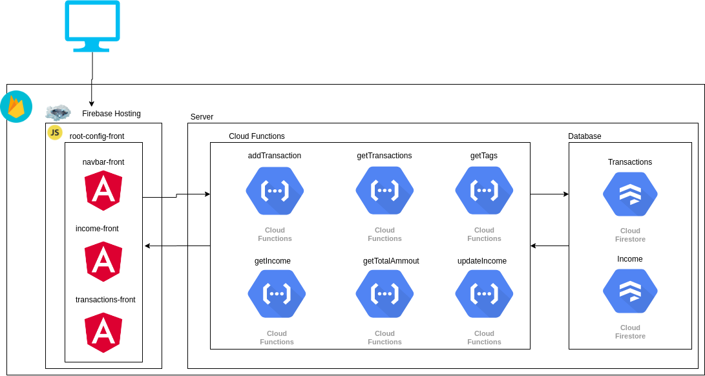

# Controla Gastos

Olá! Você já gastou descontroladamente sem pensar nos boletos de amanhã? Acredito que todos já passaram por situações parecidas, não é verdade?

Pensando neste problema construí uma aplicação chamada controla gastos, nesta aplicação você planeja uma renda mensal, o quanto quer gastar e o que você já gastou, quer experimentar clique [aqui](https://root-config-front.firebaseapp.com/) .

## Arquitetura

### Front-end
No front-end foi útilizado uma arquitertura voltada a micro front-end, uilizando o framework [single-spa](https://single-spa.js.org) que é responsável em reunir vários micro front-ends em um único aplicativo.
Foi utilizado também [angular versão 8](https://angular.io/) para a construção do micro front-ends seguindo uma arquitetua de desenvolvimento reativa com Redux, implementado com o framework [ngrx](https://ngrx.io/) e publicado no [Firebase Hosting](https://firebase.google.com/docs/hosting/?gclid=CjwKCAjwg6b0BRBMEiwANd1_SEs0-KWSSfgMpHOsPujDGj0R90oFjBNyWdBNSy4N5_6VVTX_XfuVSRoC640QAvD_BwE).

### Back-end

No back-end usei uma arquiteura baseada em [Serverless](https://serverless-stack.com/chapters/pt/what-is-serverless.html) com TypeScript para o desenvolvimento. Utilizamos o [Cloud Firestore](https://firebase.google.com/docs/firestore) como banco de dados na aplicação e as funções foram publicadas no [Cloud functions].(https://firebase.google.com/docs/functions)
Pensei nesta arquiterura pensando nos custos, na facilidade de implantação e gerenciamento de infraestrutura.

#### Desenho da arquitetura

## Projetos
Todos os projetos foram publicados na organização [controla-gastos](https://github.com/controla-gastos) no GitHub.

### [root-config-front](https://github.com/controla-gastos/root-config-front)

Este projeto é responsável por unir todos os front-ends em uma única aplicação utilizando [single-spa](https://single-spa.js.org), é um projeto bem simples mais com uma grande importância 

Para a execução local deve-se executar estes comandos:

 - npm install
 - npm start

### [transactions-front](https://github.com/controla-gastos/transactions-front)

Este projeto é responsavel pelo o front-end de transações, nele podemos cadastrar e vizualizar os nossos gastos.

Para a execução local deve-se executar estes comandos:

 - npm install
 - npm start

### [income-front](https://github.com/controla-gastos/income-front)

Este projeto é responsavel pelo o front-end de renda, nele podemos cadastrar uma renda planejada, renda atual, gastos planejados e acompanha o quanto posso gastar no mês atual.

Para a execução local deve-se executar estes comandos:

 - npm install
 - npm start

### [navbar-front](https://github.com/controla-gastos/navbar-front)

Este projeto é somente a navbar da aplicação, realmente um projeto bem simples.

Para a execução local deve-se executar estes comandos:

 - npm install
 - npm start

### [controla-gastos-functions](https://github.com/controla-gastos/controla-gastos-functions)

Este projeto é responsável pelo o nosso back-end, nele contém todas as funções serverless públicadas no [Cloud functions].(https://firebase.google.com/docs/functions).

Funções disponiveis:

| Rota | Descrição  | HTTP verbo
|--|--| --|
| https://us-central1-controlagasto-da53a.cloudfunctions.net/addTransaction | Adiciona uma transação | POST |
| https://us-central1-controlagasto-da53a.cloudfunctions.net/getIncome | Recupera dados da renda | GET |
| https://us-central1-controlagasto-da53a.cloudfunctions.net/getTags | Recupera tags do sistema | GET |
| https://us-central1-controlagasto-da53a.cloudfunctions.net/getTotalAmmount | Recupera o total gasto | GET |
| https://us-central1-controlagasto-da53a.cloudfunctions.net/getTransactions | Recupera transações | GET |
| https://us-central1-controlagasto-da53a.cloudfunctions.net/updateIncome | Atualiza informações da renda | PUT |

Para a execução local deve-se executar estes comandos:

 - npm install
 - npm run serve

##  ToDo

Infelizmente não tive muito tempo disponível para me dedicar nestes últimos 5 dias, atualmente trabalho em um projeto educacional e com esta crise as demandas vieram com mais força e com isso surgiu algus ToDos:

 - Adicionar autenticação.
 - Criar testes.
 - Criar Docker para desenvolvimento.
 - Criar pipeline para deploy automático.

 